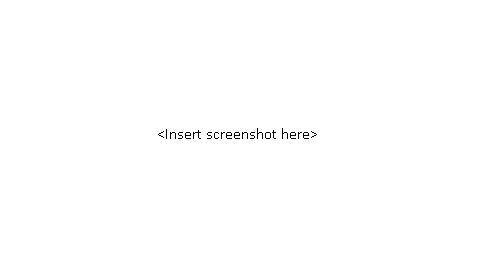

# Project1

Project1 is divided into three 3 separate sub-projects:

1. NB - Multimedia library. (Currently only on windows)
2. NGE - Game engine library.
3. The game itself. (Until I decide on a name, it'll remain as Project1Client)

The game I am making is a 2D low resolution (pixelated) rpg that has an optional mmorpg mode.

Requirements:

- Custom character creation
- Story mode and multiplayer(mmo) mode
- A world (possibly separate one for mmo)
- Side quest system
- Inventory system
- Detailed combat
- A wide variety of weapons including magic
- Horses

The world itself as well as the content, I will be making it up as I go.

